# ASP.NET Core MVC - View Components Complete Guide

## 📋 Table of Contents
1. [Introduction](#introduction)
2. [Core Concepts](#core-concepts)
3. [Implementation Guide](#implementation-guide)
4. [Strongly Typed View Components](#strongly-typed-view-components)
5. [Parameters & Customization](#parameters--customization)
6. [ViewComponentResult](#viewcomponentresult)
7. [Best Practices & Patterns](#best-practices--patterns)
8. [Partial Views vs View Components](#partial-views-vs-view-components)
9. [Interview Preparation](#interview-preparation)

---

## Introduction

### What are View Components?

**View Components** are self-contained, reusable UI building blocks in ASP.NET Core MVC that encapsulate rendering logic too complex for partial views but not requiring a full controller-view architecture.

### Purpose & Benefits


| Benefit | Description | Impact |
|---------|-------------|--------|
| **🔧 Encapsulation** | Group related UI rendering logic into cohesive units | Better code organization |
| **♻️ Reusability** | Use across multiple views to avoid duplication | Reduced maintenance |
| **🧪 Testability** | Self-contained nature makes unit testing easier | Higher code quality |
| **⚡ Performance** | Async support for I/O operations | Better scalability |
| **💉 DI Support** | Full dependency injection capabilities | Loose coupling |

### When to Use View Components


#### Decision Matrix

| Scenario | Use View Component? | Alternative |
|----------|-------------------|-------------|
| Simple HTML fragment | ❌ No | Partial View |
| Requires database access | ✅ Yes | - |
| Needs dependency injection | ✅ Yes | - |
| Complex rendering logic | ✅ Yes | - |
| Static content only | ❌ No | Partial View |
| Async operations needed | ✅ Yes | - |
| Reusable widget | ✅ Yes | - |

---

## Core Concepts

### 1. Naming Convention

**Rule**: View Component classes must end with `ViewComponent` suffix

```
✅ GridViewComponent
✅ ProductListViewComponent
✅ ShoppingCartViewComponent
✅ WeatherWidgetViewComponent

❌ Grid
❌ ProductList
❌ ShoppingCart
```

### 2. Project Structure

```
YourProject/
├── ViewComponents/
│   ├── GridViewComponent.cs
│   ├── ProductListViewComponent.cs
│   └── ShoppingCartViewComponent.cs
│
└── Views/
    └── Shared/
        └── Components/
            ├── Grid/
            │   ├── Default.cshtml
            │   └── Sample.cshtml
            ├── ProductList/
            │   └── Default.cshtml
            └── ShoppingCart/
                └── Default.cshtml
```

### 3. View Discovery Pattern

ASP.NET Core searches for view component views in this order:


### 4. Invocation Methods

| Method | Syntax | Use Case | Pros | Cons |
|--------|--------|----------|------|------|
| **Component Helper** | `@await Component.InvokeAsync("Name", args)` | Recommended approach | Clean, strongly typed | Slightly verbose |
| **Tag Helper** | `<vc:name></vc:name>` | HTML-like syntax | Concise | Less type-safe |
| **From Controller** | `return ViewComponent("Name", args)` | AJAX/API endpoints | Returns HTML fragment | Controller-specific |

---

## Implementation Guide

### Basic View Component Architecture


### Step 1: Create the View Component Class

```csharp
using Microsoft.AspNetCore.Mvc;

namespace YourProject.ViewComponents
{
    public class GridViewComponent : ViewComponent
    {
        // Synchronous method (use for simple operations)
        public IViewComponentResult Invoke()
        {
            var model = new PersonGridModel()
            {
                GridTitle = "Persons List",
                Persons = new List<Person>() 
                {
                    new Person() { PersonName = "John", JobTitle = "Manager" },
                    new Person() { PersonName = "Jane", JobTitle = "Developer" }
                }
            };
            
            return View(model);
        }
        
        // OR Asynchronous method (recommended for data access)
        public async Task<IViewComponentResult> InvokeAsync()
        {
            // Simulate async data fetch
            var model = await GetDataAsync();
            
            // Return specific view with model
            return View("Sample", model);
        }
        
        private async Task<PersonGridModel> GetDataAsync()
        {
            // Your async logic here
            await Task.Delay(100); // Placeholder
            
            return new PersonGridModel()
            {
                GridTitle = "Persons List",
                Persons = new List<Person>() 
                {
                    new Person() { PersonName = "John", JobTitle = "Manager" },
                    new Person() { PersonName = "Jane", JobTitle = "Developer" }
                }
            };
        }
    }
}
```

### Step 2: Create the View File

**Location**: `Views/Shared/Components/Grid/Sample.cshtml` or `Default.cshtml`

```html
@model PersonGridModel

<div class="grid-container">
    <h3 class="grid-title">@Model.GridTitle</h3>
    <table class="table">
        <thead>
            <tr>
                <th>Name</th>
                <th>Job Title</th>
            </tr>
        </thead>
        <tbody>
            @foreach (var person in Model.Persons)
            {
                <tr>
                    <td>@person.PersonName</td>
                    <td>@person.JobTitle</td>
                </tr>
            }
        </tbody>
    </table>
</div>
```

### Step 3: Invoke in Your Main View

```csharp
@* Method 1: Component Helper (Recommended) *@
@await Component.InvokeAsync("Grid")

@* Method 2: Tag Helper *@
<vc:grid></vc:grid>

@* Method 3: With specific view name *@
@await Component.InvokeAsync("Grid", new { viewName = "Sample" })
```

### Common Patterns

#### Pattern 1: Using ViewData (Not Recommended)

```csharp
public class GridViewComponent : ViewComponent
{
    public IViewComponentResult Invoke()
    {
        // ❌ Avoid ViewData/ViewBag
        ViewData["Title"] = "My Grid";
        ViewData["Items"] = GetItems();
        
        return View();
    }
}
```

#### Pattern 2: Strongly Typed (Recommended)

```csharp
public class GridViewComponent : ViewComponent
{
    public IViewComponentResult Invoke()
    {
        // ✅ Use strongly typed models
        var model = new GridModel 
        {
            Title = "My Grid",
            Items = GetItems()
        };
        
        return View(model);
    }
}
```

---

## Strongly Typed View Components

### Why Strongly Typed?


### Benefits Comparison

| Feature | ViewData Approach | Strongly Typed Approach |
|---------|-------------------|-------------------------|
| **Type Safety** | ❌ Runtime errors possible | ✅ Compile-time validation |
| **IntelliSense** | ❌ No support | ✅ Full support |
| **Refactoring** | ❌ Manual find/replace | ✅ Automatic IDE support |
| **Null Handling** | ⚠️ Manual checks required | ✅ Nullable reference types |
| **Documentation** | ❌ Comments only | ✅ Self-documenting |
| **Debugging** | ⚠️ Harder to trace | ✅ Easy to debug |
| **Performance** | ⚠️ Boxing/unboxing | ✅ No overhead |

### Complete Implementation

#### Step 1: Create View Model

```csharp
namespace YourProject.Models
{
    public class PersonGridModel
    {
        public string GridTitle { get; set; } = string.Empty;
        public List<Person> Persons { get; set; } = new();
        public int TotalCount => Persons?.Count ?? 0;
        public bool HasData => Persons?.Any() ?? false;
    }
    
    public class Person
    {
        public string PersonName { get; set; } = string.Empty;
        public string JobTitle { get; set; } = string.Empty;
    }
}
```

#### Step 2: Create View Component

```csharp
public class GridViewComponent : ViewComponent
{
    public async Task<IViewComponentResult> InvokeAsync()
    {
        // Create and populate strongly typed model
        PersonGridModel personGridModel = new()
        {
            GridTitle = "Persons List",
            Persons = new List<Person>() 
            {
                new() { PersonName = "John", JobTitle = "Manager" },
                new() { PersonName = "Jones", JobTitle = "Asst. Manager" },
                new() { PersonName = "William", JobTitle = "Clerk" }
            }
        };
        
        // Pass model to view
        return View("Sample", personGridModel);
    }
}
```

#### Step 3: Create Strongly Typed View

```html
@model PersonGridModel

<div class="box">
    <div class="header">
        <h3>@Model.GridTitle</h3>
        <span class="badge">@Model.TotalCount items</span>
    </div>
    
    @if (Model.HasData)
    {
        <table class="table w-100">
            <thead>
                <tr>
                    <th>Sl. No</th>
                    <th>Name</th>
                    <th>Job Title</th>
                </tr>
            </thead>
            <tbody>
                @foreach (var (person, index) in Model.Persons.Select((p, i) => (p, i)))
                {
                    <tr>
                        <td>@(index + 1)</td>
                        <td>@person.PersonName</td>
                        <td>@person.JobTitle</td>
                    </tr>
                }
            </tbody>
        </table>
    }
    else
    {
        <p class="no-data">No persons to display.</p>
    }
</div>
```

#### Step 4: Invoke from Main View

```csharp
@* Views/Home/Index.cshtml *@
<h1>Dashboard</h1>

<div class="grid-container">
    @await Component.InvokeAsync("Grid")
</div>
```

---

## Parameters & Customization

### Why Use Parameters?

Parameters make view components **flexible**, **reusable**, and **dynamic**—allowing the same component to render different data based on context.

### Parameter Flow Diagram


### Implementation Examples

#### Example 1: Single Parameter

```csharp
// View Component
public class GridViewComponent : ViewComponent
{
    public async Task<IViewComponentResult> InvokeAsync(PersonGridModel grid)
    {
        // Use the passed parameter
        return View("Sample", grid);
    }
}

// Invocation in View
@{
    var teamMembers = new PersonGridModel() 
    { 
        GridTitle = "Team Members",
        Persons = new List<Person>()
        {
            new() { PersonName = "Alice", JobTitle = "Developer" },
            new() { PersonName = "Bob", JobTitle = "Designer" }
        }
    };
}

@await Component.InvokeAsync("Grid", new { grid = teamMembers })
```

#### Example 2: Multiple Parameters

```csharp
// View Component
public class ProductListViewComponent : ViewComponent
{
    private readonly IProductService _productService;
    
    public ProductListViewComponent(IProductService productService)
    {
        _productService = productService;
    }
    
    public async Task<IViewComponentResult> InvokeAsync(
        int categoryId, 
        int maxItems = 10,
        bool showPrices = true)
    {
        var products = await _productService.GetByCategoryAsync(categoryId);
        
        var model = new ProductListModel
        {
            Products = products.Take(maxItems).ToList(),
            ShowPrices = showPrices,
            CategoryId = categoryId
        };
        
        return View(model);
    }
}

// Invocation
@await Component.InvokeAsync("ProductList", new { 
    categoryId = 5, 
    maxItems = 5,
    showPrices = true 
})
```

#### Example 3: Using Tag Helper Syntax

```html
@{
    var staffData = new PersonGridModel() 
    { 
        GridTitle = "Staff Members",
        Persons = new List<Person>()
        {
            new() { PersonName = "Eve", JobTitle = "HR Manager" }
        }
    };
}

<!-- Tag Helper approach -->
<vc:grid grid="staffData"></vc:grid>
```

### Parameter Binding Rules

| Rule | Description | Example |
|------|-------------|---------|
| **Name Matching** | Parameter names must match exactly (case-insensitive) | `grid` → `PersonGridModel grid` |
| **Anonymous Objects** | Use anonymous objects for multiple parameters | `new { id = 5, name = "Test" }` |
| **Optional Parameters** | Support default values | `int maxItems = 10` |
| **Complex Types** | Can pass entire models | `PersonGridModel grid` |
| **Value Types** | Primitives work directly | `int categoryId` |

### Advanced Parameter Patterns

#### Pattern 1: Multiple Reusable Instances

```csharp
@{
    // First grid - Team Members
    var teamGrid = new PersonGridModel() 
    { 
        GridTitle = "Team Members",
        Persons = GetTeamMembers()
    };
    
    // Second grid - Managers
    var managerGrid = new PersonGridModel() 
    { 
        GridTitle = "Managers",
        Persons = GetManagers()
    };
    
    // Third grid - Contractors
    var contractorGrid = new PersonGridModel() 
    { 
        GridTitle = "Contractors",
        Persons = GetContractors()
    };
}

<div class="dashboard">
    <div class="section">@await Component.InvokeAsync("Grid", new { grid = teamGrid })</div>
    <div class="section">@await Component.InvokeAsync("Grid", new { grid = managerGrid })</div>
    <div class="section">@await Component.InvokeAsync("Grid", new { grid = contractorGrid })</div>
</div>
```

#### Pattern 2: Configuration-Based Parameters

```csharp
public class WidgetViewComponent : ViewComponent
{
    public async Task<IViewComponentResult> InvokeAsync(WidgetConfig config)
    {
        var model = new WidgetModel
        {
            Title = config.Title,
            ShowBorder = config.ShowBorder,
            Theme = config.Theme,
            Data = await FetchDataAsync(config)
        };
        
        return View(model);
    }
}

// Usage
@await Component.InvokeAsync("Widget", new { 
    config = new WidgetConfig 
    {
        Title = "Sales Dashboard",
        ShowBorder = true,
        Theme = "dark"
    }
})
```

---

## ViewComponentResult

### Overview

`ViewComponentResult` allows you to **return view components directly from controller actions**, enabling dynamic HTML fragment generation for AJAX requests and API-style endpoints.

### Architecture Flow


### Use Cases


### Implementation Examples

#### Example 1: Basic Controller Action

```csharp
public class HomeController : Controller
{
    [Route("friends-list")]
    public IActionResult LoadFriendsList()
    {
        PersonGridModel personGridModel = new()
        {
            GridTitle = "Friends",
            Persons = new List<Person>()
            {
                new() { PersonName = "Frank", JobTitle = "Engineer" },
                new() { PersonName = "Grace", JobTitle = "Scientist" },
                new() { PersonName = "Henry", JobTitle = "Teacher" }
            }
        };
        
        // Return view component as action result
        return ViewComponent("Grid", new { grid = personGridModel });
    }
}
```

#### Example 2: AJAX Integration

**Frontend (JavaScript)**:
```html
<div class="container">
    <button id="load-friends" class="btn btn-primary">Load Friends</button>
    <div id="friends-container"></div>
</div>

<script>
document.getElementById('load-friends').addEventListener('click', async () => {
    const response = await fetch('/friends-list');
    const html = await response.text();
    document.getElementById('friends-container').innerHTML = html;
});
</script>
```

**Backend (Controller)**:
```csharp
[Route("friends-list")]
public async IActionResult LoadFriendsList()
{
    var friends = await _friendService.GetFriendsAsync();
    
    var model = new PersonGridModel
    {
        GridTitle = "Your Friends",
        Persons = friends
    };
    
    return ViewComponent("Grid", new { grid = model });
}
```

#### Example 3: Dynamic Widget Loading

```csharp
[HttpGet("widgets/{widgetType}")]
public IActionResult LoadWidget(string widgetType, [FromQuery] int? categoryId)
{
    return widgetType.ToLower() switch
    {
        "products" => ViewComponent("ProductList", new { categoryId = categoryId ?? 0 }),
        "cart" => ViewComponent("ShoppingCart"),
        "weather" => ViewComponent("Weather"),
        "news" => ViewComponent("RecentNews", new { count = 5 }),
        _ => Content("<p>Widget not found</p>", "text/html")
    };
}
```

#### Example 4: Modal Content

```csharp
[HttpGet("product-details/{productId}")]
public async Task<IActionResult> GetProductDetails(int productId)
{
    var product = await _productService.GetByIdAsync(productId);
    
    if (product == null)
    {
        return NotFound();
    }
    
    return ViewComponent("ProductDetails", new { product });
}
```

**Frontend**:
```javascript
async function showProductModal(productId) {
    const response = await fetch(`/product-details/${productId}`);
    const html = await response.text();
    
    document.getElementById('modal-content').innerHTML = html;
    openModal();
}
```

### Response Types Comparison

| Result Type | Purpose | Content Type | Use Case |
|------------|---------|--------------|----------|
| `ViewComponentResult` | Return view component | HTML | AJAX, widgets, fragments |
| `ViewResult` | Return full view | HTML | Complete page render |
| `PartialViewResult` | Return partial view | HTML | Simple fragments |
| `JsonResult` | Return JSON data | JSON | API responses |
| `ContentResult` | Return raw content | Text/HTML | Simple strings |

---

## Best Practices & Patterns

### 1. Dependency Injection Pattern

```csharp
public class ProductListViewComponent : ViewComponent
{
    private readonly IProductService _productService;
    private readonly ILogger<ProductListViewComponent> _logger;
    private readonly IMemoryCache _cache;
    
    public ProductListViewComponent(
        IProductService productService,
        ILogger<ProductListViewComponent> logger,
        IMemoryCache cache)
    {
        _productService = productService;
        _logger = logger;
        _cache = cache;
    }
    
    public async Task<IViewComponentResult> InvokeAsync(int categoryId)
    {
        try
        {
            var cacheKey = $"products_category_{categoryId}";
            
            if (!_cache.TryGetValue(cacheKey, out List<Product> products))
            {
                products = await _productService.GetByCategoryAsync(categoryId);
                _cache.Set(cacheKey, products, TimeSpan.FromMinutes(5));
            }
            
            return View(products);
        }
        catch (Exception ex)
        {
            _logger.LogError(ex, "Error loading products for category {CategoryId}", categoryId);
            return Content("Unable to load products");
        }
    }
}
```

### 2. Async Operations Best Practices

| Practice | ✅ Do This | ❌ Avoid This |
|----------|-----------|--------------|
| **Method Signature** | `Task<IViewComponentResult> InvokeAsync()` | `IViewComponentResult Invoke()` for async ops |
| **Awaiting** | `await _service.GetDataAsync()` | `.Result` or `.Wait()` |
| **Error Handling** | Try-catch with async | Blocking calls |
| **Multiple Calls** | `await Task.WhenAll()` | Sequential awaits |

```csharp
// ✅ Good: Parallel async operations
public async Task<IViewComponentResult> InvokeAsync()
{
    var productsTask = _productService.GetProductsAsync();
    var categoriesTask = _categoryService.GetCategoriesAsync();
    var featuredTask = _productService.GetFeaturedAsync();
    
    await Task.WhenAll(productsTask, categoriesTask, featuredTask);
    
    var model = new DashboardModel
    {
        Products = await productsTask,
        Categories = await categoriesTask,
        Featured = await featuredTask
    };
    
    return View(model);
}
```

### 3. Error Handling Strategy


```csharp
public async Task<IViewComponentResult> InvokeAsync(int userId)
{
    try
    {
        var user = await _userService.GetUserAsync(userId);
        
        if (user == null)
        {
            return View("NotFound");
        }
        
        return View(user);
    }
    catch (ServiceException ex)
    {
        _logger.LogWarning(ex, "Service error for user {UserId}", userId);
        return View("ServiceError");
    }
    catch (Exception ex)
    {
        _logger.LogError(ex, "Unexpected error for user {UserId}", userId);
        return Content("Unable to load user information");
    }
}
```

### 4. Caching Strategy

```csharp
public class NewsWidgetViewComponent : ViewComponent
{
    private readonly INewsService _newsService;
    private readonly IMemoryCache _cache;
    private const string CacheKey = "recent_news";
    private static readonly TimeSpan CacheDuration = TimeSpan.FromMinutes(10);
    
    public NewsWidgetViewComponent(INewsService newsService, IMemoryCache cache)
    {
        _newsService = newsService;
        _cache = cache;
    }
    
    public async Task<IViewComponentResult> InvokeAsync(int count = 5)
    {
        var news = await _cache.GetOrCreateAsync(
            $"{CacheKey}_{count}",
            async entry =>
            {
                entry.AbsoluteExpirationRelativeToNow = CacheDuration;
                return await _newsService.GetRecentNewsAsync(count);
            });
        
        return View(news);
    }
}
```

### 5. Project Organization

```
✅ Recommended Structure:

YourProject/
├── ViewComponents/
│   ├── Navigation/
│   │   └── MenuViewComponent.cs
│   ├── Products/
│   │   ├── ProductListViewComponent.cs
│   │   └── ProductCardViewComponent.cs
│   └── Widgets/
│       ├── WeatherViewComponent.cs
│       └── NewsViewComponent.cs
│
├── Models/
│   └── ViewComponents/
│       ├── MenuViewModel.cs
│       ├── ProductListViewModel.cs
│       └── WeatherViewModel.cs
│
└── Views/
    └── Shared/
        └── Components/
            ├── Menu/
            │   └── Default.cshtml
            ├── ProductList/
            │   ├── Default.cshtml
            │   └── Grid.cshtml
            └── Weather/
                └── Default.cshtml
```

### 6. Things to Avoid

| ❌ Avoid | ✅ Do Instead | Reason |
|---------|--------------|--------|
| Overusing for simple content | Use partial views | Unnecessary complexity |
| Direct database queries | Use services/repositories | Separation of concerns |
| Complex business logic | Move to services | Single responsibility |
| Tight coupling to controllers | Use DI and interfaces | Reusability |
| Synchronous I/O operations | Use async/await | Performance |
| Large view component methods | Break into helper methods | Maintainability |

### 7. Performance Checklist

- ✅ Use async/await for I/O operations
- ✅ Implement caching for expensive operations
- ✅ Use `IMemoryCache` or distributed cache
- ✅ Avoid N+1 query problems
- ✅ Limit data returned to view
- ✅ Use pagination for large datasets
- ✅ Profile and optimize slow operations
- ✅ Consider output caching

---

## Partial Views vs View Components

### Detailed Comparison


### Feature Matrix

| Feature | Partial Views | View Components |
|---------|--------------|-----------------|
| **Complexity** | ⭐ Simple, static | ⭐⭐⭐ Complex, dynamic |
| **Data Access** | ❌ Limited, via ViewData | ✅ Full data access via services |
| **Dependency Injection** | ❌ No | ✅ Yes, via constructor |
| **Parameters** | ⚠️ Basic model passing | ✅ Rich parameter support |
| **Testability** | ⚠️ Harder to isolate | ✅ Easy to unit test |
| **Async Support** | ⚠️ Limited | ✅ Full async/await support |
| **Business Logic** | ❌ Should avoid | ✅ Can contain (limited) |
| **Service Layer Access** | ❌ No | ✅ Yes |
| **Caching** | ⚠️ Manual | ✅ Built-in support |
| **Best For** | Simple UI fragments | Complex, reusable widgets |
| **Invocation** | `@await Html.PartialAsync()` | `@await Component.InvokeAsync()` |
| **Return from Controller** | `PartialView()` | `ViewComponent()` |
| **File Location** | `Views/Shared/` | `Views/Shared/Components/` |
| **Class Required** | ❌ No | ✅ Yes |
| **Lifecycle** | Simple render | Full component lifecycle |

### When to Choose What

#### Choose Partial Views When:
- ✅ Displaying simple, static HTML fragments
- ✅ No data access or business logic needed
- ✅ Just need to reuse markup
- ✅ Performance is critical (less overhead)
- ✅ Quick implementation needed

**Example Use Cases:**
- Footer content
- Copyright notices
- Simple navigation links
- Static HTML blocks
- Template fragments

#### Choose View Components When:
- ✅ Need to access database or external services
- ✅ Require dependency injection
- ✅ Complex rendering logic needed
- ✅ Need async operations
- ✅ Component requires unit testing
- ✅ Multiple data sources involved

**Example Use Cases:**
- Shopping cart summary
- User login panel
- Dynamic navigation menu
- Recent articles/news widget
- Weather widget
- Social media feeds
- Search results
- Product recommendations

### Side-by-Side Code Comparison

#### Partial View Example

```csharp
// No class needed

// Views/Shared/_UserCard.cshtml
@model UserModel

<div class="user-card">
    <h4>@Model.Name</h4>
    <p>@Model.Email</p>
</div>

// Usage in main view
@await Html.PartialAsync("_UserCard", userModel)
```

#### View Component Example

```csharp
// ViewComponents/UserCardViewComponent.cs
public class UserCardViewComponent : ViewComponent
{
    private readonly IUserService _userService;
    
    public UserCardViewComponent(IUserService userService)
    {
        _userService = userService;
    }
    
    public async Task<IViewComponentResult> InvokeAsync(int userId)
    {
        var user = await _userService.GetUserAsync(userId);
        return View(user);
    }
}

// Views/Shared/Components/UserCard/Default.cshtml
@model UserModel

<div class="user-card">
    <h4>@Model.Name</h4>
    <p>@Model.Email</p>
    <span>Last seen: @Model.LastSeen</span>
</div>

// Usage in main view
@await Component.InvokeAsync("UserCard", new { userId = 123 })
```

### Migration Path


---

## Interview Preparation

### Common Interview Questions & Answers

#### Q1: What is a View Component and how does it differ from a Partial View?

**Answer Structure:**


**Sample Answer:**
> "A View Component is a self-contained, reusable UI building block in ASP.NET Core MVC that encapsulates rendering logic along with data access. Unlike Partial Views, View Components support full dependency injection, can perform async operations, access services directly, and are easier to unit test. I'd use a View Component when I need to fetch data, perform complex logic, or create testable, reusable widgets like shopping carts or dynamic navigation menus."

---

#### Q2: Explain the lifecycle of a View Component

**Lifecycle Diagram:**


**Key Lifecycle Points:**

| Phase | Description | Important Notes |
|-------|-------------|-----------------|
| **1. Invocation** | View component called from view | Can pass parameters |
| **2. Resolution** | DI container resolves dependencies | Constructor injection |
| **3. Execution** | `InvokeAsync` method executes | Async operations here |
| **4. Data Processing** | Fetch and transform data | Use services |
| **5. View Selection** | Determine which view to render | Default or named view |
| **6. Rendering** | View file rendered with model | Returns HTML |
| **7. Injection** | HTML injected into parent view | Complete |

---

#### Q3: How do you pass data to a View Component?

**Answer with Examples:**

```mermaid
graph TD
    A[Data Passing Methods] --> B[Via Parameters]
    A --> C[Via Services]
    A --> D[Via ViewData]
    
    B --> B1[✅ Recommended]
    B --> B2[Type-safe]
    B --> B3[Clear contract]
    
    C --> C1[✅ Good for shared data]
    C --> C2[Uses DI]
    
    D --> D1[❌ Avoid]
    D --> D2[Not type-safe]
    
    style B fill:#4CAF50,color:#fff
    style C fill:#2196F3,color:#fff
    style D fill:#f44336,color:#fff
```



**Method 1: Parameters (Recommended)**
```csharp
// View Component
public async Task<IViewComponentResult> InvokeAsync(int userId, bool showDetails = true)
{
    var user = await _userService.GetUserAsync(userId);
    return View(new UserViewModel { User = user, ShowDetails = showDetails });
}

// Invocation
@await Component.InvokeAsync("UserProfile", new { userId = 123, showDetails = true })
```

**Method 2: Via Services**
```csharp
// View Component
public class CurrentUserViewComponent : ViewComponent
{
    private readonly IHttpContextAccessor _httpContextAccessor;
    private readonly IUserService _userService;
    
    public async Task<IViewComponentResult> InvokeAsync()
    {
        var userId = _httpContextAccessor.HttpContext.User.GetUserId();
        var user = await _userService.GetUserAsync(userId);
        return View(user);
    }
}
```

---

#### Q4: When should you use ViewComponentResult in a controller?

**Decision Tree:**


**Use Cases Table:**

| Scenario | Use ViewComponentResult? | Reason |
|----------|-------------------------|--------|
| AJAX content loading | ✅ Yes | Returns reusable component |
| Modal popup content | ✅ Yes | Self-contained logic |
| API endpoint returning HTML | ✅ Yes | Component architecture |
| Infinite scroll items | ✅ Yes | Consistent rendering |
| Full page render | ❌ No | Use `ViewResult` |
| Simple text response | ❌ No | Use `ContentResult` |
| JSON data | ❌ No | Use `JsonResult` |

---

#### Q5: How do you unit test a View Component?

**Test Structure:**

```csharp
public class ProductListViewComponentTests
{
    private readonly Mock<IProductService> _mockProductService;
    private readonly ProductListViewComponent _component;
    
    public ProductListViewComponentTests()
    {
        _mockProductService = new Mock<IProductService>();
        _component = new ProductListViewComponent(_mockProductService.Object);
    }
    
    [Fact]
    public async Task InvokeAsync_WithValidCategory_ReturnsViewWithProducts()
    {
        // Arrange
        var categoryId = 1;
        var expectedProducts = new List<Product>
        {
            new Product { Id = 1, Name = "Product 1" },
            new Product { Id = 2, Name = "Product 2" }
        };
        
        _mockProductService
            .Setup(s => s.GetByCategoryAsync(categoryId))
            .ReturnsAsync(expectedProducts);
        
        // Act
        var result = await _component.InvokeAsync(categoryId);
        
        // Assert
        var viewResult = Assert.IsType<ViewViewComponentResult>(result);
        var model = Assert.IsType<List<Product>>(viewResult.ViewData.Model);
        Assert.Equal(2, model.Count);
    }
    
    [Fact]
    public async Task InvokeAsync_ServiceThrowsException_ReturnsErrorView()
    {
        // Arrange
        _mockProductService
            .Setup(s => s.GetByCategoryAsync(It.IsAny<int>()))
            .ThrowsAsync(new ServiceException("Service error"));
        
        // Act
        var result = await _component.InvokeAsync(1);
        
        // Assert
        var contentResult = Assert.IsType<ContentViewComponentResult>(result);
        Assert.Contains("error", contentResult.Content.ToLower());
    }
}
```

---

#### Q6: Explain dependency injection in View Components

**DI Flow:**


**Implementation Example:**

```csharp
// 1. Register services in Startup.cs or Program.cs
builder.Services.AddScoped<IProductService, ProductService>();
builder.Services.AddScoped<ICategoryService, CategoryService>();

// 2. View Component with DI
public class ProductCatalogViewComponent : ViewComponent
{
    private readonly IProductService _productService;
    private readonly ICategoryService _categoryService;
    private readonly ILogger<ProductCatalogViewComponent> _logger;
    private readonly IMemoryCache _cache;
    
    // Constructor injection
    public ProductCatalogViewComponent(
        IProductService productService,
        ICategoryService categoryService,
        ILogger<ProductCatalogViewComponent> logger,
        IMemoryCache cache)
    {
        _productService = productService;
        _categoryService = categoryService;
        _logger = logger;
        _cache = cache;
    }
    
    public async Task<IViewComponentResult> InvokeAsync(int categoryId)
    {
        // Use injected services
        var category = await _categoryService.GetByIdAsync(categoryId);
        var products = await _productService.GetByCategoryAsync(categoryId);
        
        _logger.LogInformation("Loaded {Count} products for category {CategoryId}", 
            products.Count, categoryId);
        
        return View(new ProductCatalogModel 
        { 
            Category = category, 
            Products = products 
        });
    }
}
```

---

### Real-World Scenarios

#### Scenario 1: E-Commerce Shopping Cart

```csharp
public class ShoppingCartViewComponent : ViewComponent
{
    private readonly ICartService _cartService;
    private readonly IHttpContextAccessor _httpContextAccessor;
    
    public ShoppingCartViewComponent(
        ICartService cartService,
        IHttpContextAccessor httpContextAccessor)
    {
        _cartService = cartService;
        _httpContextAccessor = httpContextAccessor;
    }
    
    public async Task<IViewComponentResult> InvokeAsync()
    {
        var userId = _httpContextAccessor.HttpContext?.User.GetUserId();
        
        if (string.IsNullOrEmpty(userId))
        {
            return View("Empty");
        }
        
        var cart = await _cartService.GetCartAsync(userId);
        
        var model = new ShoppingCartViewModel
        {
            Items = cart.Items,
            TotalItems = cart.Items.Sum(i => i.Quantity),
            TotalPrice = cart.Items.Sum(i => i.Price * i.Quantity),
            HasItems = cart.Items.Any()
        };
        
        return View(model);
    }
}
```

#### Scenario 2: Dynamic Navigation Menu

```csharp
public class NavigationMenuViewComponent : ViewComponent
{
    private readonly IMenuService _menuService;
    private readonly IMemoryCache _cache;
    private readonly IAuthorizationService _authService;
    
    public async Task<IViewComponentResult> InvokeAsync(string location = "main")
    {
        var cacheKey = $"menu_{location}_{User.Identity?.Name ?? "anonymous"}";
        
        var menu = await _cache.GetOrCreateAsync(cacheKey, async entry =>
        {
            entry.SlidingExpiration = TimeSpan.FromMinutes(30);
            
            var allItems = await _menuService.GetMenuItemsAsync(location);
            
            // Filter by authorization
            var authorizedItems = new List<MenuItem>();
            foreach (var item in allItems)
            {
                var authorized = await _authService.AuthorizeAsync(
                    User, 
                    item.RequiredPolicy);
                    
                if (authorized.Succeeded)
                {
                    authorizedItems.Add(item);
                }
            }
            
            return authorizedItems;
        });
        
        return View(menu);
    }
}
```

#### Scenario 3: Recent Activity Feed

```csharp
public class RecentActivityViewComponent : ViewComponent
{
    private readonly IActivityService _activityService;
    private readonly IUserService _userService;
    
    public async Task<IViewComponentResult> InvokeAsync(int userId, int count = 10)
    {
        var activities = await _activityService.GetRecentAsync(userId, count);
        
        // Enrich with user data
        var userIds = activities.Select(a => a.UserId).Distinct();
        var users = await _userService.GetUsersByIdsAsync(userIds);
        var userDict = users.ToDictionary(u => u.Id);
        
        var model = activities.Select(a => new ActivityViewModel
        {
            Activity = a,
            User = userDict.GetValueOrDefault(a.UserId),
            TimeAgo = GetTimeAgo(a.Timestamp)
        }).ToList();
        
        return View(model);
    }
    
    private string GetTimeAgo(DateTime timestamp)
    {
        var span = DateTime.UtcNow - timestamp;
        
        return span.TotalMinutes switch
        {
            < 1 => "just now",
            < 60 => $"{(int)span.TotalMinutes} minutes ago",
            < 1440 => $"{(int)span.TotalHours} hours ago",
            _ => $"{(int)span.TotalDays} days ago"
        };
    }
}
```

---

### Advanced Topics

#### 1. View Component Discovery

**How ASP.NET Core finds View Components:**


#### 2. Output Caching

```csharp
// Startup.cs
builder.Services.AddResponseCaching();
app.UseResponseCaching();

// Controller
[ResponseCache(Duration = 300, VaryByQueryKeys = new[] { "categoryId" })]
public IActionResult GetProducts(int categoryId)
{
    return ViewComponent("ProductList", new { categoryId });
}
```

#### 3. Multiple View Support

```csharp
public class UserProfileViewComponent : ViewComponent
{
    public async Task<IViewComponentResult> InvokeAsync(int userId, string viewType = "default")
    {
        var user = await _userService.GetUserAsync(userId);
        
        return viewType.ToLower() switch
        {
            "compact" => View("Compact", user),
            "detailed" => View("Detailed", user),
            "card" => View("Card", user),
            _ => View(user) // Default.cshtml
        };
    }
}
```

---

### Quick Reference Card

#### Syntax Cheat Sheet

```csharp
// ═══════════════════════════════════════════════════════════
// CREATING VIEW COMPONENTS
// ═══════════════════════════════════════════════════════════

// Basic structure
public class MyViewComponent : ViewComponent
{
    public IViewComponentResult Invoke()
    {
        return View();
    }
    
    // OR async version (preferred)
    public async Task<IViewComponentResult> InvokeAsync()
    {
        return View();
    }
}

// With dependency injection
public class MyViewComponent : ViewComponent
{
    private readonly IMyService _service;
    
    public MyViewComponent(IMyService service)
    {
        _service = service;
    }
    
    public async Task<IViewComponentResult> InvokeAsync()
    {
        var data = await _service.GetDataAsync();
        return View(data);
    }
}

// ═══════════════════════════════════════════════════════════
// INVOKING VIEW COMPONENTS
// ═══════════════════════════════════════════════════════════

// In Views
@await Component.InvokeAsync("MyComponent")
@await Component.InvokeAsync("MyComponent", new { param1 = value1 })
<vc:my-component param1="value1"></vc:my-component>

// In Controllers
return ViewComponent("MyComponent");
return ViewComponent("MyComponent", new { param1 = value1 });

// ═══════════════════════════════════════════════════════════
// RETURNING RESULTS
// ═══════════════════════════════════════════════════════════

return View();                          // Default.cshtml
return View("ViewName");                // ViewName.cshtml
return View(model);                     // Default.cshtml with model
return View("ViewName", model);         // ViewName.cshtml with model
return Content("text");                 // Plain text
return Json(data);                      // JSON response

// ═══════════════════════════════════════════════════════════
// VIEW COMPONENT WITH PARAMETERS
// ═══════════════════════════════════════════════════════════

public async Task<IViewComponentResult> InvokeAsync(
    int id,                             // Required parameter
    string filter = "all",              // Optional with default
    bool includeInactive = false)       // Optional boolean
{
    // Logic here
    return View(model);
}

// Invoke with parameters
@await Component.InvokeAsync("MyComponent", new { 
    id = 123, 
    filter = "active",
    includeInactive = true 
})
```

---

### Key Takeaways


### Interview Success Checklist

- ✅ Understand the difference between Partial Views and View Components
- ✅ Know when to use each approach
- ✅ Explain dependency injection in View Components
- ✅ Demonstrate parameter passing
- ✅ Show async/await implementation
- ✅ Explain ViewComponentResult usage
- ✅ Discuss caching strategies
- ✅ Provide real-world examples
- ✅ Explain testing approach
- ✅ Understand view discovery mechanism
- ✅ Know the component lifecycle
- ✅ Discuss performance considerations

---

## Summary

View Components are powerful, self-contained UI building blocks in ASP.NET Core MVC that bridge the gap between simple partial views and complex controllers. They excel at encapsulating reusable UI logic that requires data access, dependency injection, or async operations.

**Key Advantages:**
-  **Full DI Support**: Inject any registered service
-  **Async Operations**: Perfect for I/O-bound operations
-  **Highly Testable**: Easy to unit test with mocks
-  **Reusable**: Use across multiple views and contexts
-  **Type-Safe**: Strongly typed models prevent errors

**Remember:**
- Use View Components for complex, data-driven widgets
- Use Partial Views for simple, static HTML fragments
- Always prefer async methods for I/O operations
- Leverage dependency injection for loose coupling
- Keep components focused on rendering logic
- Test components independently for quality assurance

**Golden Rule**: If your component needs data access, services, or complex logic—choose View Components. If it's just markup—use Partial Views.